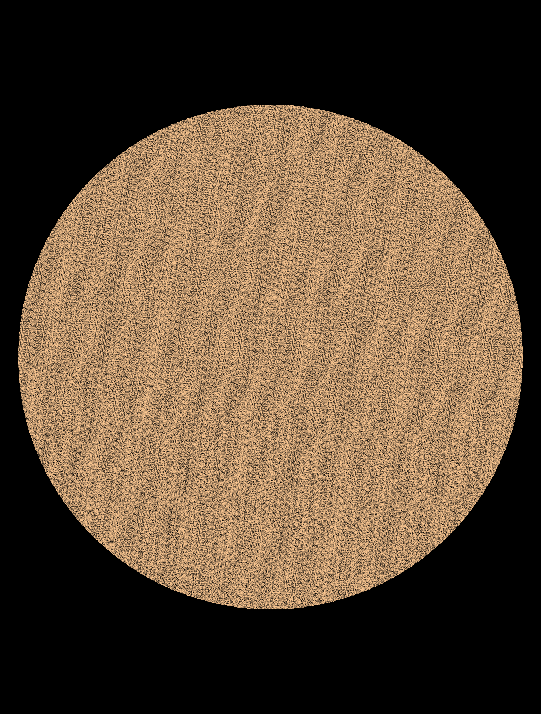
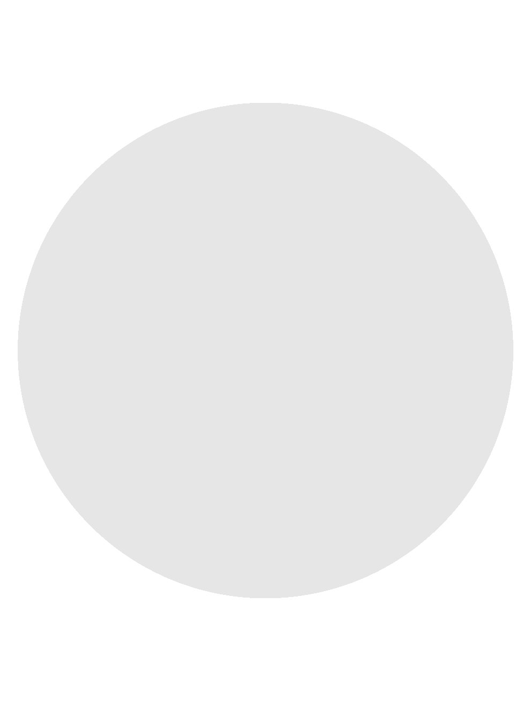
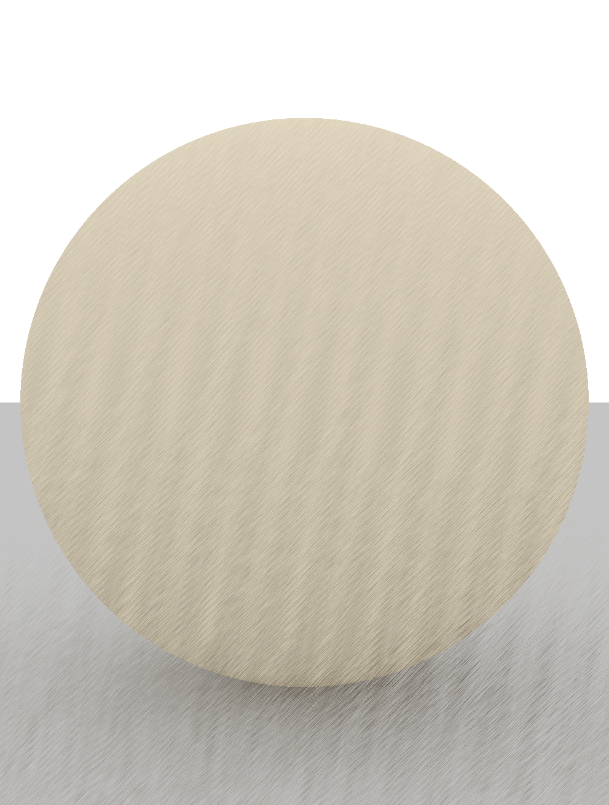
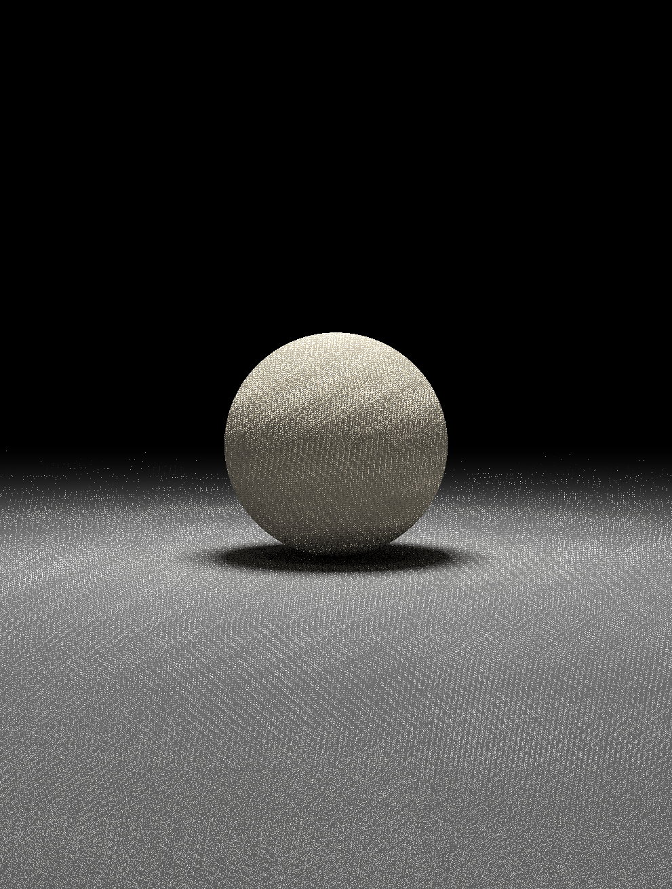
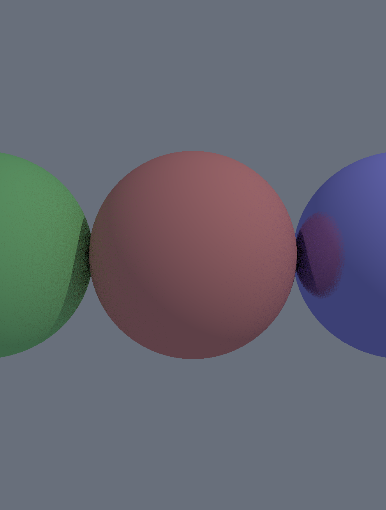
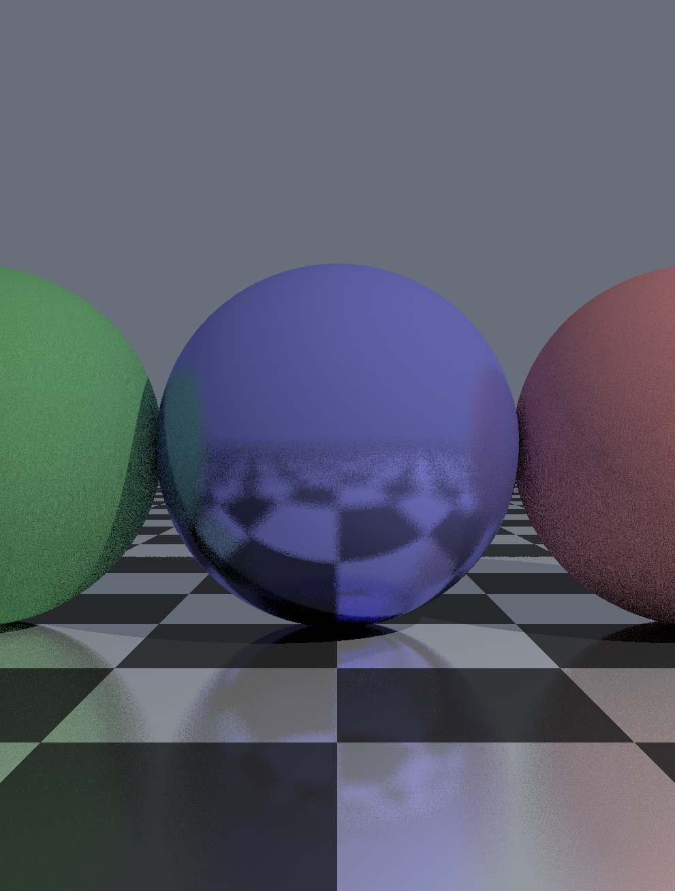
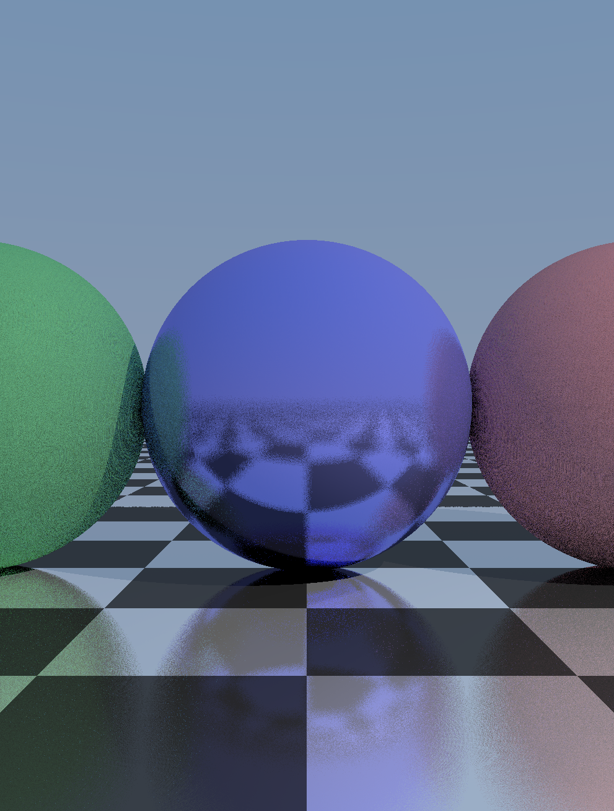
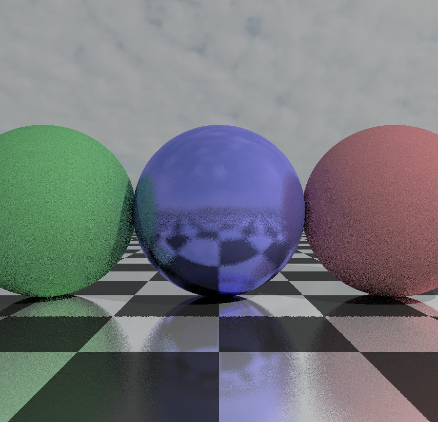
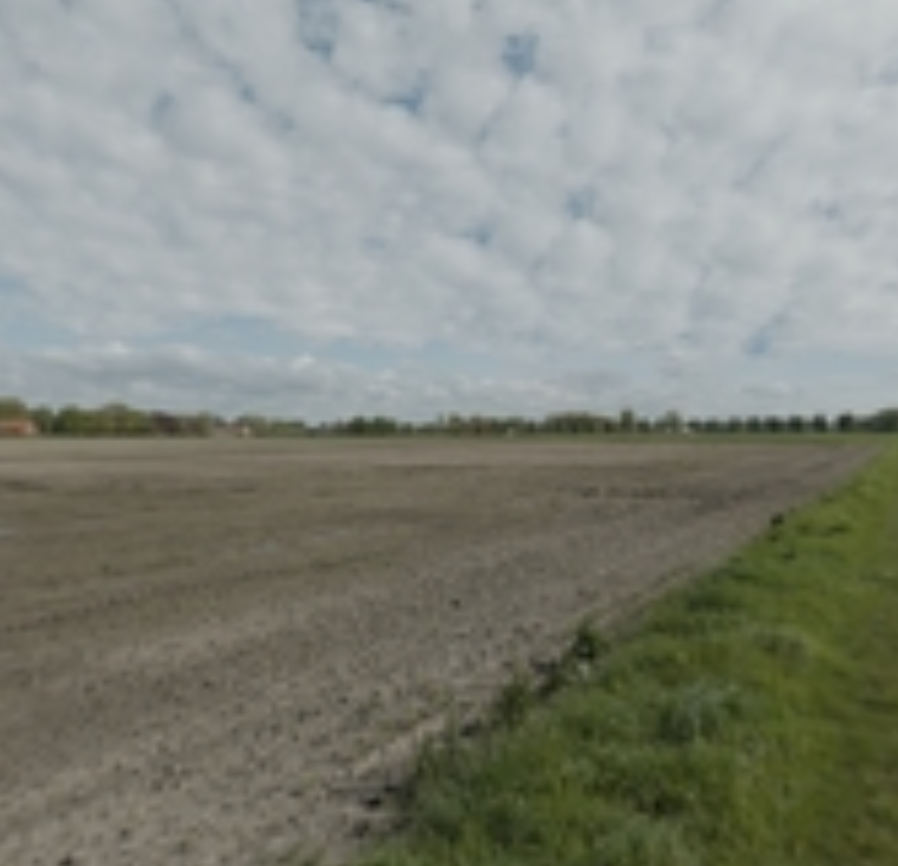

# ShaderToy 

## What's this

My test code for shadertoy

## How to use

A. Run on Web browser
1. open https://www.shadertoy.com/new on web brower (i.e, chrome )
2. copy and paste to .shader file to shader inputs pane.
3. click Triangle icon at left-bottom of shader inputs pane.

B. Run on Visual Sdutio code
1. Install plugin 
"Shader Toy" https://marketplace.visualstudio.com/items?itemName=stevensona.shader-toy&ssr=false#overview

2. open .shader file and right-click and choose "ShaderToy : show GLSL Previuew"

## Content

### 000_minimal_pt.shader
- Ray - sphere intersection
- Hemisphere sampling

### 001_simple_pt.shader
 - Multi sampling

### 002_simple_pt_floor.shader
 - Add Floor and bounce

### 003_simple_pt_light_shadow.shader
 - Add light and shadow

### 004_simple_pt_BRDF.shader
 - Add multi materials

### 005_simple_pt_BRDF_floor.shader
 - Add floor with checker board pattern

### 006_simple_pt_BRDF_sky.shader

- Add Sky light color

### 007_simple_pt_BRDF_IBL.shader

- Add IBL (enviroment texture)

### 008_simple_pt_BRDF_IBL.shader

- Enviroment map test

